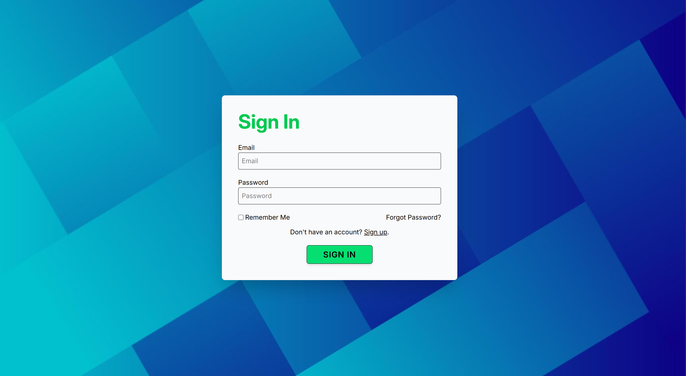
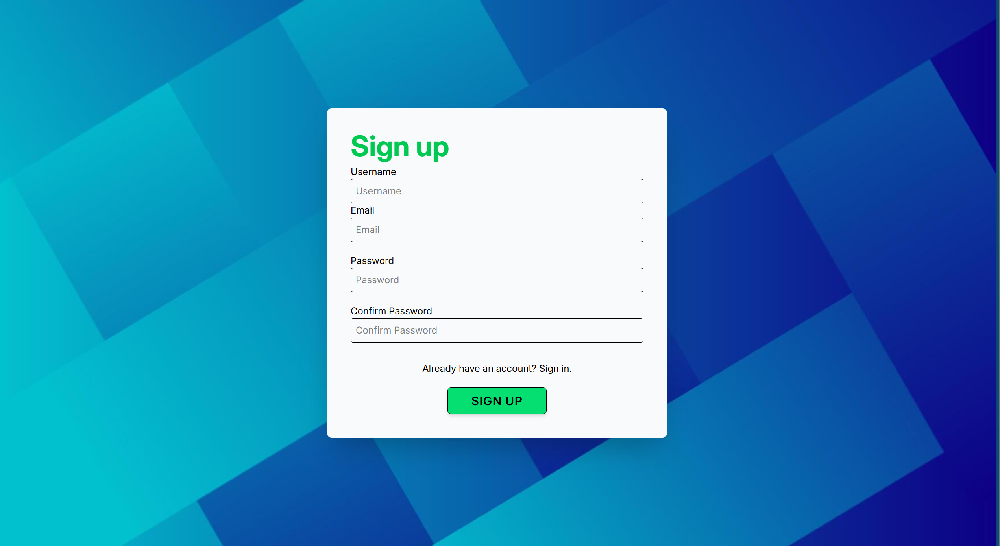
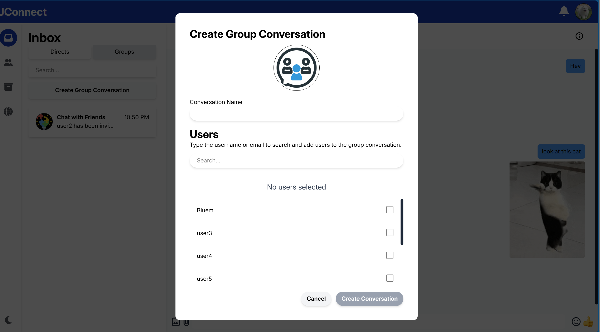
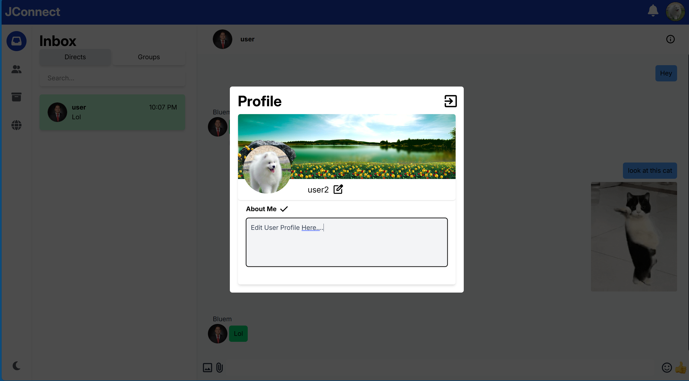
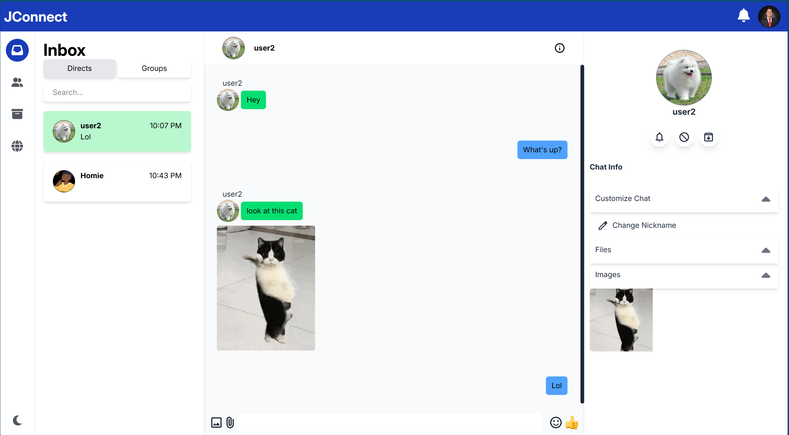
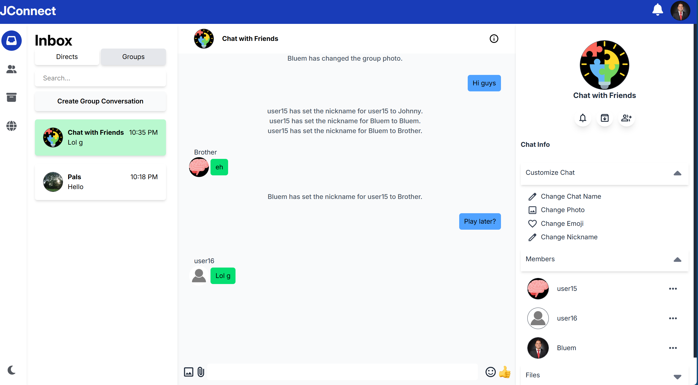
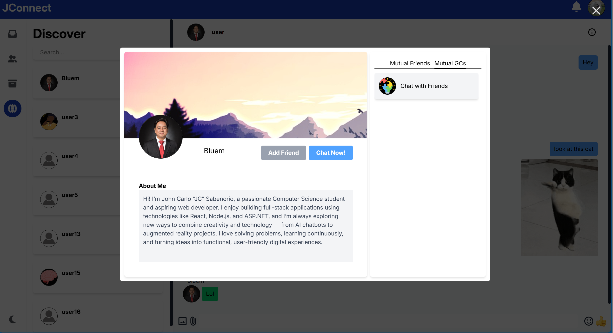
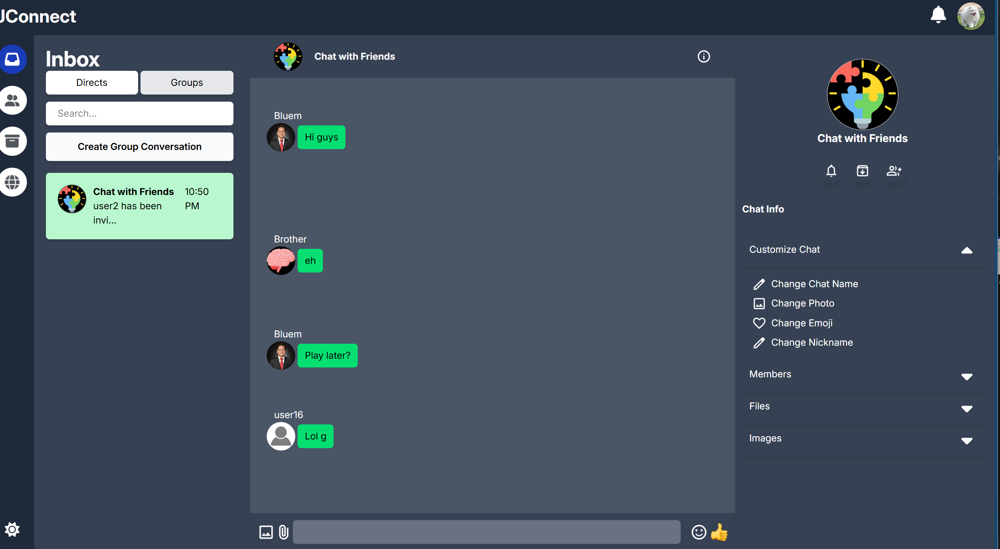

# 💬 JConnect

**JConnect** is a real-time chat application powered by **Socket.io**, inspired by **Messenger** and **Discord**. It enables users to connect, send messages, share files, create group conversations, and experience seamless real-time communication — all in a modern, responsive interface.

---

## 📑 Table of Contents

- [About](#about)
- [Features](#features)
- [Screenshots](#screenshots)
- [Tech Stack](#tech-stack)
- [Installation](#installation)

---

## About

**JConnect** was developed as a personal full-stack learning project to explore **real-time web communication** using **Socket.io** and modern JavaScript frameworks.

### Objectives
- To provide a **real-time chat platform** where users can interact dynamically.
- To simulate the **modern messaging experience** similar to Messenger or Discord.
- To explore **WebSockets**, **user authentication**, and **file sharing** integration.

### Who is it for?
- Developers exploring **Socket.io** or **real-time communication**.
- Users looking for a lightweight, modern chat experience.
- Students or enthusiasts building **portfolio projects** with full-stack technologies.

---

## Features

| Category | Description |
|-----------|-------------|
| 💬 **Messaging** | Send and receive real-time messages instantly. |
| 🔐 **User Authentication** | Secure login and registration system. |
| 👥 **Group Conversations** | Create and manage group chats effortlessly. |
| 📎 **File & Image Sharing** | Upload and send images or documents. |
| 🔔 **Real-Time Notifications** | Get notified when new messages arrive. |
| 👤 **User Profiles** | Check user profiles, status, mutual friends, and group chats. |
| 😄 **Reactions** | React to messages with emojis. |
| 🌗 **Light & Dark Mode** | Switch between light and dark themes. |
| 🗂️ **Archived Conversations** | Archive chats for better organization. |
| 🤝 **Friends** | Send or receive friend requests from other users. |
| 🎨 **Chat Customization** | Edit nicknames, group chat names, and more. |
| ✉️ **Forgot Password** | Reset your password by receiving a verification link via email. |
| 🔁 **Remember User** | Stay logged in on the same device securely. |
---

## 🖼️ Screenshots

| **Sign In** | **Sign Up** |
|:-----------:|:------------:|
|  |  |
| **Create Group Chat** | **Edit Profile** |
|  |  |
| **Direct Conversation** | **Group Chat Conversation** |
|  |  |
| **View Profile** | **Dark Mode** |
|  |  |

---

## Tech Stack

**Frontend:**  
- React  
- TailwindCSS  
- Axios
- Redux
- Socket.io Client

**Backend:**  
- Node.js  
- Express  
- Socket.io
- Postman

**Database:**  
- MongoDB (Mongoose)

**Tools & Others:**  
- JWT Authentication  
- Multer (for file uploads)
- Sharp (for image resizing and format conversion)  
- ESLint + Prettier (for code formatting)
- React Photo View (Lightbox component for interacting with images)
- Emoji Picker React (Customizable emoji picker component)

---

## Installation

### 1️⃣ Clone the Repository
```bash
git clone https://github.com/yourusername/jconnect.git
cd jconnect
